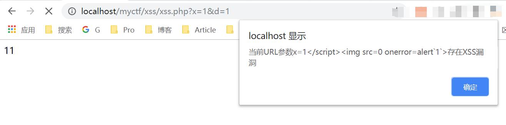
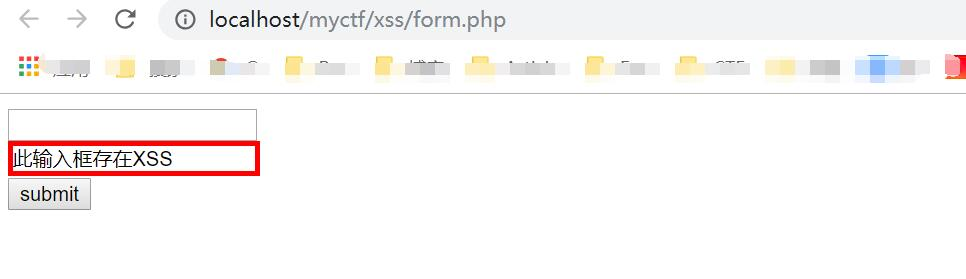

基于chrome 的被动扫描xss 插件。

二次开发: https://github.com/BlackHole1/autoFindXssAndCsrf

## Usage

更多工具->扩展程序->开启开发者模式->加载已解压的程序(AutoFindXss目录下AutoFindXSS目录)

## dmeo:

GET:

```
<?php 

$x = $_GET['x'];
$d = htmlspecialchars($_GET['d']);
echo $x;
echo $d;
```



POST:
```
<?php 
echo @$_POST['d'];
?>

<!DOCTYPE html>
<html lang="en">
<head>
	<meta charset="UTF-8">
	<title>Document</title>
</head>
<body>
	<form action="#" method="post">
		<input type="text" name="x"><br/>
		<input type="text" name="d"><br/>
		<input type="submit" value="submit">
	</form>
</body>
</html>
```

